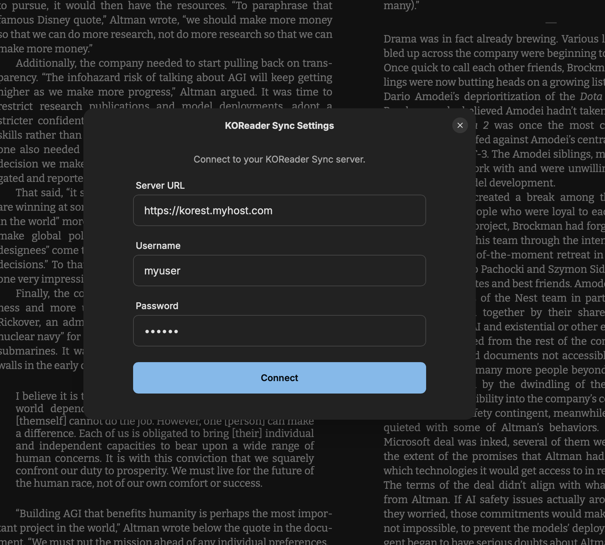

# KoRest 
Self-hosted **reading progress syncronization** for your ebooks across **Readest Apps** 

- 📱 **Readest everywhere** — phones, tablets, and desktops stay in step on where you left off in a book.
- ✨ **No Readest signup** — use KoRest for sync without creating a Readest cloud account.
- 🪶 **Small drop-in** — lightweight alternative to [KOReader Sync Server](https://github.com/koreader/koreader-sync-server)
- 🧩 **Multi-arch Docker** — **arm64** and **amd64** images, it runs natively on Apple Silicon and ARM boards
- 🏠 **Self-hosted** — reading progress stays on **your** self-hosted server; nothing is sent to a vendor’s sync cloud.


## Quick start (Docker Compose, recommended)

Pre-built images are on **GitHub Container Registry**: [`ghcr.io/peet86/korest`](https://github.com/peet86/korest/pkgs/container/korest).

**Option A — download the compose file and run** (no git clone):

```bash
mkdir korest && cd korest
curl -fsSL -o docker-compose.yml https://raw.githubusercontent.com/peet86/korest/main/docker-compose.yml
docker compose pull && docker compose up -d
```

**Option B — clone this repo**, then from the project directory:

```bash
docker compose pull && docker compose up -d
```

That publishes port **4242** and stores SQLite in the named volume **`korest-data`**.

To pin a version instead of `latest`, set `image` in `docker-compose.yml` to a tag listed on the [container package](https://github.com/peet86/korest/pkgs/container/korest) (for example `ghcr.io/peet86/korest:v1.0.0`).

### `docker run` without Compose

```bash
docker run -d --name korest -p 4242:4242 -v korest-data:/data ghcr.io/peet86/korest:latest
```

### Build the image locally (from source)

```bash
git clone https://github.com/peet86/korest.git && cd korest
docker build -t korest:local .
docker run -d --name korest -p 4242:4242 -v korest-data:/data korest:local
```

## Configuration (optional)

| Environment variable | Meaning |
|----------------------|--------|
| `PORT` | HTTP port (default **4242** in the Docker image and when running locally without `PORT`). |
| `KOREST_DATABASE_PATH` | Where SQLite stores data (default **`/data/korest.db`**). |
| `LOG_INCOMING_REQUESTS` | `true` / `false` — extra request logging for debugging. |

### A word on privacy and HTTPS

KoRest stores whatever **login secret** your client sends (Readest follows the same pattern as KOReader here—typically a **hash**, not your plain-text password). Treat the SQLite file like any credential store. **Use HTTPS** in front of KoRest on the public internet so sync traffic is not readable in transit.

A standard healthcheck endpoint is already exposed for you on /healthstatus with JSON ressponee (healthy, counts, database path) in case your traefik or uptime monitoring requires it. 

---

## Setup in Readest



Open the **menu** in Readest and choose **KOReader Sync**. Set the **custom sync server** to your KoRest URL, for example `https://sync.myserver.com`—use HTTPS when the server is reachable from the internet. Pick any **username** and **password** you like: KoRest will **create the account on first use** and store it in your database. Use the **same** username and password on every device so progress stays in sync. KoRest supports **multiple users**; each pair of credentials is isolated.

---

## Why this project exists

I already had a reading stack I liked: **Audiobookshelf** holds my audiobooks and ebooks, an **OPDS** bridge exposes those libraries to readers, and **Readest** is my go-to app for ebooks on every device. The missing piece was **reading progress**: picking up the same book on another phone or tablet without relying on someone else’s sync server. KoRest fills that gap—self-hosted, small, and built for that one job.

### A self-hosted stack that works well

| Role | What I use |
|------|----------------|
| **Library** | [Audiobookshelf](https://github.com/advplyr/audiobookshelf) — one place for audiobooks and ebooks. |
| **Reader** | [Readest](https://github.com/readest/readest) — open, capable ebook reader across devices. |
| **Audiobooks** | [Prologue](https://prologue-app.com/) — listens straight to my Audiobookshelf libraries. |
| **OPDS for Readest** | Something like [abs-opds](https://github.com/Vito0912/abs-opds) — self-hosted OPDS in front of Audiobookshelf so Readest can browse and open books. |
| **Progress sync** | **KoRest (this repo)** — keeps Readest in sync on where I left off, on hardware I control. |

---

## License

[MIT](LICENSE) — you may use and modify the project freely; keep the copyright notice so the author is credited.
